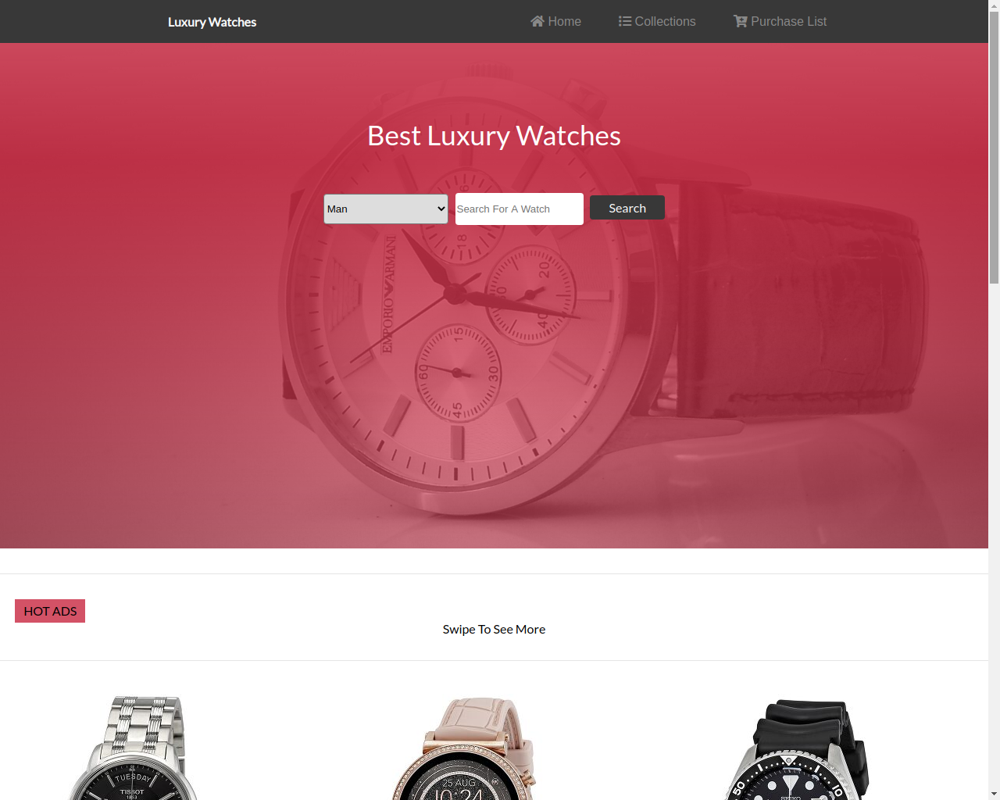

# Online-Shop-Capstone
> This project was created by the design of ZATTIX and has customized content. The main goal of this project was to follow design of website and show skills by making web site of someones design.

This project is the 8th one in the HTML/CSS module at Microverse, also it is Capstone which means its lats one in this module.

I worked on all the requirements given on this project.

Aligned all elements with float and flex or grid.
Used semantic HTML elements for the header, the main content and the footer.
I styled the elements to look like on the design.
I used some CSS positioning techniques like Flexbox and Grid.
Also I added 3 breakpoints for responsiveness.
## Built With

- HTML5
- CSS3
- Javascript
- Slick
## Live Demo

[Live Demo Link](https://nostalgic-dijkstra-dddde0.netlify.app/)

## Author

👤 **Nikola Zdrale**

- GitHub: [@zdrale](https://github.com/zdrale)
- Twitter: [@zdralenikola](https://twitter.com/zdralenikola)
- LinkedIn: [@nikola-zdrale](https://www.linkedin.com/in/nikola-zdrale/)

## Acknowledgement

I have followed the design given by Mohammed Awad on Behance
